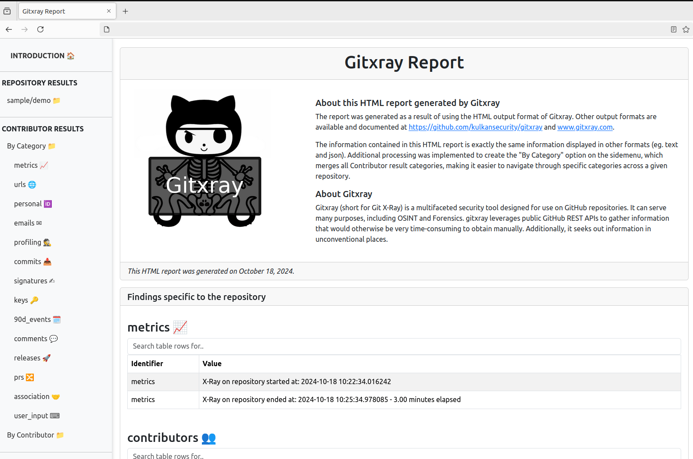

# Features &#128171;

Because of the amount of data it analyzes, `gitxray` can be a bit overwhelming at first. Let's look at a few examples of potential awesome findings which can better explain why you're here and why `gitxray` is awesome &hearts;. 

## A user-friendly HTML report &#x1F4CA;

`gitxray` now offers a default output format of `html`, creating a [Bootstrap](https://www.getbootstrap.com)-backed HTML report which offers easy navigation through Repository, Contributor and non-Contributor results.<div style="clear: both;"></div> <div style="clear: both;"></div>

## Unintended disclosures in Contributor profiles &#128064;

`gitxray` reports under a `user_input` category any user-supplied data that repository Contributors may have exposed via their GitHub accounts inadevertently. This is normally the case of PGP and SSH key name fields, which unfortunately are used by Users to record hostnames, computer models, password locations (e.g. in 1Password), or even the _password itself_ to a given key (which we all know might be the same password used elsewhere). To make things more interesting, `gitxray` also identifies any "excess" data found before, or after, PGP Armored keys published in a User's GitHub account. Wondering what that data normally is? Erroneous copy/pastes from the command line while exporting in ASCII/Armored format their keys. And what might that contain? Most of the times, a shell prompt revealing a local username, a hostname and a directory path. May I remind you all of this data is Public-facing.

You may focus specifically on these types of findings by filtering results with:
```py
gitxray -o https://github.com/SampleOrg -f user_input
```
or, for a specific repository:
``` py
gitxray -r https://github.com/SampleOrg/SampleRepo -f user_input
```

## Spotting shared, co-owned or fake Contributors &#128123;

Open source projects are under attack, with malicious actors hiding in plain sight. GitHub has [released a Security alert](https://github.blog/security/vulnerability-research/security-alert-social-engineering-campaign-targets-technology-industry-employees/) describing one of potentially many modus-operandi adopted by Threat actors. So why not panic (a bit) and see if there's anything you could do to help protect the repositories you care about?

`gitxray` reports under the `association` category information that could help identify cases of suspicious activity or identity. By fingerprinting Keys added to a profile, as well as those historically used to sign a commit, and by looking at, for example, key and account creation times, it becomes possible to cross-reference the data and link _(hence 'association')_ the behavior to 2 or more accounts.

You can focus specifically on association findings by filtering for `association` with:

``` 
gitxray -o https://github.com/SampleOrg -f association 
```
or targetting a specific Repository with:
```
gitxray -r https://github.com/SampleOrg/SampleRepo -f association
```

### Important 

Associations MUST NOT be directly and blindly used to report fake or shadow accounts. They are automatic observations from a piece of well-intended code. Do NOT treat association results as findings directly. We must protect open-source projects by first and foremost respecting open-source developers. Ensure that any actions taken are thoughtful and based on solid evidence, not just automated associations. 

## Duplicate Repository Name Check &#128737;

`gitxray` will always check and detect duplicate repository names across different organizations and user profiles. This helps identify potential cloned or fake repositories. `gitxray` compares your target repository against others with the same name and the highest star count, ensuring you are engaging with the most popular (and likely legitimate) one.

## Forensics: What happened on the day of an incident? &#128269;

Because `gitxray` collects data from multiple sources of activity including Commits, Comments, Workflow Runs, Issues, Deployments and more; and because `gitxray` shows activity in a standarized YYYY-MM-DD format, it becomes possible to use Filtering in order to place focus on specific activity happening at a specific point in time.

For example, by running `gitxray` with the following arguments, only results from that specific date are returned. You may place focus on a day, or even a month:

``` 
gitxray -r https://github.com/SampleOrg/SampleRepo -f 2024-08 -outformat text
gitxray -r https://github.com/SampleOrg/SampleRepo -f 2024-09-01 -outformat text
```

An outformat of type `text` can help in this specific use-case more than the defaul `html` report.

## Analyzing Commit Hours to Identify Anomalies &#128347;

`gitxray` provides a summary of contributor commit hours, allowing you to profile contributor activity and detect potential anomalies. This feature helps you understand typical patterns and flag unusual behavior for further investigation.

## Untrustworthy Repositories and Activity &#127988;

`gitxray` can be used to protect yourself, your team and your customers from fake Repositories and suspicious activity. For example, by analyzing commit dates and comparing them to the account creation timestamp of contributors, `gitxray` can flag inconsistencies that may indicate:

* Tampered Commits: Some repositories may be manipulated to appear older than they actually are, such as claiming that all commits date back six years when the repository was only created a week ago. This tactic is often used to increase perceived value. Unfortunately, altering commit dates is relatively easy in Git, and GitHub is no exception. More on this [here](https://www.reddit.com/r/git/comments/ympce5/is_it_possible_to_change_commit_date/).

* Reclaimed Usernames: Trusted contributors might have had their accounts deleted and then re-registered by malicious actors. GitHub allows a username to be re-released after 90 days, making this a possible attack vector. Learn more about GitHub’s account deletion policy [here](https://docs.github.com/en/account-and-profile/setting-up-and-managing-your-personal-account-on-github/managing-your-personal-account/deleting-your-personal-account#deleting-your-personal-account).

It is possible to focus on unreliable historic activity by filtering for Warning keywords:

``` 
gitxray -o https://github.com/SampleOrg -f warning
```

## X-Raying GitHub Workflows &#9881; 

The Workflows X-Ray module is executed upon identifying existing Workflows or Actions. `gitxray` provides in-depth analysis and monitoring of GitHub workflows, including:

* Execution Analysis: Provides detailed insights into workflow execution, showing how many times each workflow was executed by contributors and non-contributors. This allows for better understanding of usage patterns and detection of unauthorized or unexpected activity.

* Detection of deleted runs: This feature helps identify whether workflow runs have been deleted, potentially indicating an attempt to erase traces of malicious activity or legitimate maintenance actions.

* Security Checks for Workflows: Performs a series of basic security checks on workflows to identify uses of Secrets, Self-hosted Runners and Potentially dangerous triggers (eg pull_request_target) that could pose a security risk.

### Disclaimer: Gitxray is NOT a complete Workflow Security Scanner

For more information on tools which are specialized in scanning Workflows refer to our [Vulnerable Workflows section](vulnerable_workflows.md).


## The PR Rejection Awards &#127942; 

Another `gitxray` feature is the ability to list a TOP 3 of GitHub accounts that have tried to submit Pull Requests to the repository, which ended up closed AND NOT merged. In certain emotional scenarios, this could be paraphrased as _rejected PRs_. Kidding aside, in some cases, this could lead to identifying Contributors who have repeatedly failed at merging a very evidently unaligned piece of code to a branch (I know, it sounds unlikely for an account to try and merge backdoor.py repeatedly... but is it?).

`gitxray` will show a TOP 3 list specific to Repository Contributors and a separate list for accounts which are NOT Contributors to the Repository.

These findings, if any exist, are reported under a `contributors` category along with additional information related to other Repository Contributors. You can focus specifically on findings from the contributors category by filtering for `contributors` with:

``` 
gitxray -o https://github.com/SampleOrg -f contributors 
```
or targetting a specific Repository with:
``` bash
gitxray -r https://github.com/SampleOrg/SampleRepo -f contributors
```
## Fake Starring, Private repos gone Public and more &#128584; 

GitHub shares publicly [up to 90 days of past Events](https://docs.github.com/en/rest/activity/events?apiVersion=2022-11-28) for any User account, which include actions such as Repository creation, Watching, Committing, Pull Requesting, and more. `gitxray` includes these events under a `90d_events` category in the results included for each Contributor.

For example, Events you may come across that would be interesting include:

- A user having very recently _switched a repository from PRIVATE to PUBLIC_. GitHub requires Users to tick several boxes prior to moving an existing private repository to public, lowering the chances of an unintended leak; however, a recent public repository may not have had as much attention and auditing as you would think.

- A user [starring](https://docs.github.com/en/rest/activity/starring?apiVersion=2022-11-28) (originally known as _watching_) too many respositories too rapidly. This could be a tell of an account used for [Stargazing](https://research.checkpoint.com/2024/stargazers-ghost-network/). Or it could just be a normal human being in one of those days filled with anxiety.

- And more!

To find Contributors who recently switched from Private to Public a repository or who have Starred repositories, you may start with:
``` 
gitxray -o https://github.com/SampleOrg -f starred,private
```

And you could then target a specific Repository Contributor to get more information:
``` 
gitxray -r https://github.com/SampleOrg/SampleRepo -c some_user
```
## Lots of e-mail addresses &#128231; and Profiling data &#128100;

`gitxray` will report for each Contributor, an `emails` category listing all unique e-mail address collected from parsing:

* The User's profile
* Each commit made by the User
* PGP Primary Keys and PGP SubKeys

Additionally, Personal Information (e.g. social networks) voluntarily made Public by the User is extracted from multiple sources including PGP Key BLOBs and reported under a `personal` category.

Finally, the `profiling` category tends to display information related to the account itself (e.g. creation date, last updated, and more.)

You may focus specifically on `emails`, `personal`, and `profiling` fields with:
```py
gitxray -o https://github.com/SampleOrg -f emails,personal,profiling
```
or, for a specific repository, with: 
``` py
gitxray -r https://github.com/SampleOrg/SampleRepo -f emails,personal,profiling
```

## Looking out for malicious Releases and Assets &#128065; 

It is possible for Threat Actors to compromise credentials of a Repository Maintainer in order to deploy malware by silently updating released Assets (the typical package you would download when a Release includes downloadable Assets); which is why `gitxray` looks at all Repository Releases and informs of:

* Assets that were **updated** at least a day **AFTER** their release, which might lead to suggest they've been infected and/or tampered with. Or it could just be a maintainer fixing an asset without wanting to create a new release.

* Users who have historically created releases and/or uploaded assets, as well as the % vs. the total amount of releases or assets uploaded in the repository; which may allow you to flag potential suspicious activity. For example, you might notice an account which never created Releases before now uploading assets.


All of this information is included by `gitxray` in a `releases` category, which means you can focus on those results (if any exist) with:

``` bash
gitxray -o https://github.com/SampleOrg -f releases
```

## Anonymous contributors &#128065; 

As stated in [GitHub documentation](https://docs.github.com/en/rest/repos/repos?apiVersion=2022-11-28#list-repository-contributors), only the first 500 author email addresses in a Repository will link to actual GitHub users or accounts. The rest will appear as "anonymous" contributors without associated GitHub information.

Additionally, when an author's email address in a commit is not associated with a GitHub account, the User will also be considered Anonymous.

Lucky for us, `gitxray` also includes within its output the entire list of Anonymous contributors received from GitHub. The list is first processed to combine all variations of Names used by the author for a same e-mail, which means the list can also be pretty useful when, for example, executing OSINT.

To filter for anonymous contributors, you may use:
``` bash
gitxray -o https://github.com/SampleOrg -f anonymous
```

## And so much more.

We've covered a large amount of use-cases for `gitxray`, yet we're nowhere finished. Start X-Raying today your favorite Organizations and Repositories and discover more ways of connecting dots. 
