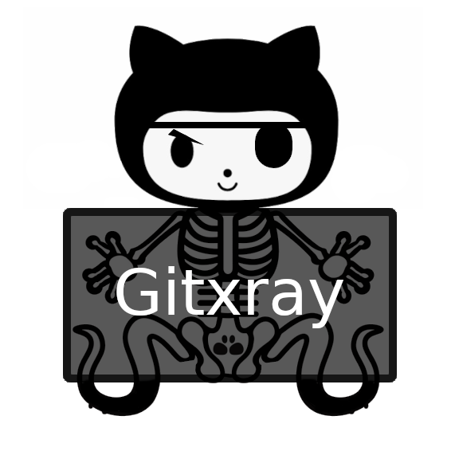

# Welcome to Gitxray

{ width="300", align="left" }

Gitxray (short for Git X-Ray) is a multifaceted security tool designed for use on GitHub repositories. It can serve many purposes, including OSINT and Forensics. `gitxray` leverages public GitHub REST APIs to gather information that would otherwise be very time-consuming to obtain manually. Additionally, it seeks out information in unconventional places.

## Getting started with `gitxray`

* [Installing Gitxray](installing.md)
* [Awesome Features](awesome_features.md) &#128171;
* [More Features](more_features.md) &#129470;

## Rate Limits and the GitHub API

Gitxray gracefully handles Rate Limits and can work out of the box without a GitHub API key, _but_ you'll likely hit RateLimits pretty fast. This is detailed by GitHub in their [documentation here](https://docs.github.com/en/rest/using-the-rest-api/rate-limits-for-the-rest-api?apiVersion=2022-11-28#primary-rate-limit-for-unauthenticated-users). A simple read-only token created for PUBLIC repositories will however help you increase those restrictions considerably. If you're not in a hurry or can leave `gitxray` running you'll be able to use its full capacity, as it pauses execution while waiting for the limits to lift.

## License

`gitxray` is provided under the terms and conditions of the [GNU Affero GPL v3 License](https://www.gnu.org/licenses/agpl-3.0.txt).
